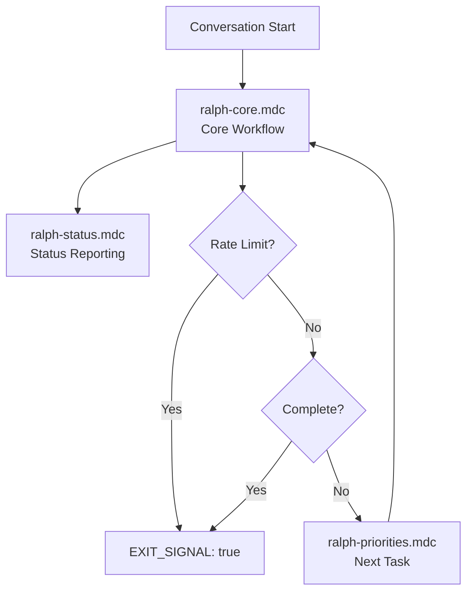
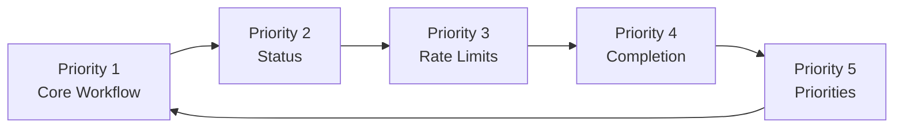

# Ralph Workflow Rules

> Autonomous development agent rules that transform Cursor into a systematic, controlled development loop.

---

## What is This?

This directory contains Cursor rules that automate the **Ralph autonomous development workflow**. These rules guide AI assistants to:

- Follow a systematic development process
- Work on one task at a time
- Report status consistently
- Detect and handle rate limits
- Know when work is complete
- Prioritize tasks effectively

**Result:** A controlled, observable development loop that prevents infinite loops and provides clear progress tracking.

---

## Quick Start

### For Users

**Starting a Ralph Loop:**

1. Open a new conversation in Cursor
2. Say: "Follow the Ralph workflow. Work on the highest priority task from @fix_plan.md"
3. The rules automatically guide the AI through the workflow
4. Check the `RALPH_STATUS` block at the end of each response

**Loop Control:**

- **Continue:** `EXIT_SIGNAL: false` → Start next conversation
- **Stop:** `EXIT_SIGNAL: true` → Work complete or rate limited

### For Developers

**Understanding the System:**

1. Read [INDEX.md](INDEX.md) for quick reference
2. See [ARCHITECTURE.md](ARCHITECTURE.md) for visual diagrams
3. Review individual rule files for details

---

## Rule Flow Overview



**The Loop:**

1. **Core Workflow** executes the task
2. **Status Reporting** captures progress
3. **Rate Limit Check** prevents infinite loops
4. **Completion Check** determines when done
5. **Priorities** select next task (if continuing)

---

## The Rules

### Core Workflow (`ralph-core.mdc`)

**Priority:** 1 (Highest)  
**Purpose:** Primary workflow engine

**What it does:**

- Studies specifications (`specs/*`)
- Reviews priorities (`@fix_plan.md`)
- Implements ONE task
- Runs tests
- Updates documentation

**Key Principles:**

- ONE task per conversation
- Search before assuming
- Quality over speed
- Always include status block

---

### Product Owner Persona (`ralph-product-owner.mdc`)

**Priority:** 1.5  
**Purpose:** Product strategy and requirements management

**What it does:**

- Defines product strategy and business goals
- Prioritizes work by business value and user impact
- Creates and updates specifications
- Validates alignment with business goals
- Communicates decisions and trade-offs

**Key Principles:**

- Business value first
- User-centric thinking
- Data-driven decisions
- Clear specifications
- Strategic thinking

**When to use:**

- Product strategy work needed
- Requirements definition
- Prioritization decisions
- Specification creation/updates

---

### QA/Testing Persona (`ralph-qa.mdc`)

**Priority:** 1.6  
**Purpose:** Quality assurance, test creation, bug detection

**What it does:**

- Writes comprehensive tests for implemented features
- Validates functionality and acceptance criteria
- Detects bugs before deployment
- Tests edge cases and error conditions
- Maintains test coverage and documentation

**Key Principles:**

- Test coverage first
- Acceptance criteria driven
- Edge case focus
- Automated testing
- Quality standards

**When to use:**

- Tests need to be written for features
- Acceptance criteria need validation
- Bug detection or quality assurance is needed
- Test coverage needs improvement

---

### Code Reviewer Persona (`ralph-reviewer.mdc`)

**Priority:** 1.7  
**Purpose:** Code quality, best practices, refactoring guidance

**What it does:**

- Reviews code for quality and consistency
- Validates architecture and design patterns
- Identifies refactoring opportunities
- Ensures adherence to coding standards
- Provides constructive feedback

**Key Principles:**

- Quality first
- Best practices
- Project conventions
- Constructive feedback
- Architecture validation

**When to use:**

- Code review needed
- Code quality validation required
- Architecture validation needed
- Refactoring opportunities need identification
- Code quality standards need enforcement

---

### Technical Writer Persona (`ralph-docs.mdc`)

**Priority:** 1.8  
**Purpose:** Documentation creation and maintenance

**What it does:**

- Writes technical documentation
- Creates API reference documentation
- Maintains README files
- Writes user guides and tutorials
- Documents architectural decisions

**Key Principles:**

- Clarity first
- User-focused
- Comprehensive
- Maintainable
- Accessible

**When to use:**

- Documentation needs to be created or updated
- API documentation is needed
- User guides need to be written
- Documentation needs improvement or maintenance

---

### DevOps/Infrastructure Persona (`ralph-devops.mdc`)

**Priority:** 1.9  
**Purpose:** CI/CD, deployment, infrastructure management

**What it does:**

- Configures CI/CD pipelines
- Manages deployment configurations
- Handles infrastructure setup
- Monitors deployment health
- Ensures reliable deployment and operations

**Key Principles:**

- Automation first
- Reliability
- Security
- Monitoring
- Documentation

**When to use:**

- CI/CD pipelines need configuration
- Deployment setup is needed
- Infrastructure configuration is required
- Deployment or infrastructure issues need resolution

---

### Status Reporting (`ralph-status.mdc`)

**Priority:** 2  
**Purpose:** Enables loop control (CRITICAL)

**What it does:**

- Defines mandatory status block format
- Requires status block at end of every response
- Provides loop control mechanism

**Status Block Format:**

```
---RALPH_STATUS---
STATUS: IN_PROGRESS | COMPLETE | BLOCKED
TASKS_COMPLETED_THIS_LOOP: <number>
FILES_MODIFIED: <number>
TESTS_STATUS: PASSING | FAILING | NOT_RUN
WORK_TYPE: IMPLEMENTATION | TESTING | DOCUMENTATION | REFACTORING
EXIT_SIGNAL: false | true
RECOMMENDATION: <one line summary>
---END_RALPH_STATUS---
```

**Why Critical:** Without status blocks, loop control is impossible.

---

### Rate Limit Handling (`ralph-rate-limits.mdc`)

**Priority:** 3  
**Purpose:** Prevents infinite loops (Safety)

**What it does:**

- Detects rate limit indicators
- Immediately sets `EXIT_SIGNAL: true`
- Prevents wasted API calls

**Rate Limit Indicators:**

- "rate limit", "429", "quota exceeded"
- "too many requests", "limit reached"

**Override Priority:** Highest (can interrupt everything)

---

### Completion Detection (`ralph-completion.mdc`)

**Priority:** 4  
**Purpose:** Knows when to stop

**What it does:**

- Checks `@fix_plan.md` for completed tasks
- Verifies tests are passing
- Sets `EXIT_SIGNAL: true` when complete

**Completion Criteria:**

- All tasks in `@fix_plan.md` marked [x]
- Tests passing (or no tests for valid reasons)
- No errors or warnings
- All requirements implemented

---

### Task Prioritization (`ralph-priorities.mdc`)

**Priority:** 5  
**Purpose:** Selects next task

**What it does:**

- Reads `@fix_plan.md`
- Finds highest priority uncompleted task
- Guides task selection for next iteration

**Priority Order:**

1. High Priority (critical, blocking)
2. Medium Priority (important, enhancements)
3. Low Priority (polish, optimizations)

---

## Rule Priority System

Rules are applied in priority order (1 → 5), but execution is more nuanced:



**Key Insight:** Priority 3 (Rate Limits) can override all other rules for safety.

---

## Integration with Project Files

These rules work with your project structure:

| Project File            | Used By                      | Purpose                      |
| ----------------------- | ---------------------------- | ---------------------------- |
| `@fix_plan.md`          | Core, Priorities, Completion | Task priorities and tracking |
| `specs/prd-auraflix.md` | Core                         | Project requirements         |
| `specs/prd.json`        | Core                         | User story requirements      |
| `PROMPT.md`             | Core                         | Detailed workflow reference  |

---

## How It Works

### Automatic Application

1. **Cursor reads `.mdc` files** from `.cursor/rules/`
2. **Rules with `alwaysApply: true`** are applied to every conversation
3. **Priority order** determines application sequence
4. **Status blocks** enable loop control

### Loop Execution

**Single Conversation:**

1. Core workflow executes task
2. Status block generated
3. Rate limit check runs
4. Completion check runs
5. Priorities inform next iteration

**Loop Control:**

- `EXIT_SIGNAL: false` → Continue with next conversation
- `EXIT_SIGNAL: true` → Stop (complete or rate limited)

---

## Customization

### Editing Rules

Edit `.mdc` files to adjust:

- Workflow steps
- Priority logic
- Completion criteria
- Rate limit handling
- Status reporting format

### Important Notes

- **File location:** Rules must be in `.cursor/rules/`
- **File extension:** Must be `.mdc`
- **YAML front matter:** Required for metadata
- **`alwaysApply: true`:** Makes rule apply automatically
- **Priority:** Determines application order

---

## Troubleshooting

### Rules Not Being Applied

**Check:**

- Files are in `.cursor/rules/` directory
- File extensions are `.mdc`
- YAML front matter is correct
- `alwaysApply: true` is set

### Status Blocks Missing

**Check:**

- `ralph-status.mdc` rule exists
- `alwaysApply: true` is set in front matter
- Rule priority is set correctly

### Infinite Loops

**Check:**

- `ralph-rate-limits.mdc` rule exists
- Rate limit detection is working
- `EXIT_SIGNAL: true` is set when appropriate
- Completion criteria are being met

### Tasks Not Prioritizing

**Check:**

- `@fix_plan.md` exists and is readable
- `ralph-priorities.mdc` rule exists
- Task format in `@fix_plan.md` is correct

---

## Benefits

### For Development

- **Systematic Process:** Consistent workflow every time
- **Clear Progress:** Status blocks show exactly what's done
- **No Infinite Loops:** Rate limit detection prevents wasted calls
- **Task Focus:** ONE task per conversation prevents confusion
- **Completion Detection:** Knows when to stop

### For Automation

- **Controlled Loops:** Status blocks enable loop control
- **Observable:** Progress is visible and trackable
- **Safe:** Rate limits prevent API abuse
- **Maintainable:** Clear rules are easy to modify

---

## Philosophy

### Design Principles

1. **Priority Order Matters** - Rules apply sequentially
2. **Status is Critical** - Required for loop control
3. **Safety First** - Rate limits can interrupt everything
4. **Single Task Focus** - ONE task per conversation
5. **Explicit Exit** - Completion must be verified

### Core Concept

> Rules transform Cursor from a command-driven assistant into a systematic, controlled development loop.

**The Insight:**  
Status blocks enable loop control. Rate limit detection prevents infinite loops. Completion detection knows when to stop. Priorities guide task selection. Together, they create a controlled, observable development process.

---

## Documentation

### Quick Reference

- **[INDEX.md](INDEX.md)** - Quick reference, priority table, navigation
- **[ARCHITECTURE.md](ARCHITECTURE.md)** - Visual diagrams, rule relationships

### Rule Files

- **[ralph-core.mdc](ralph-core.mdc)** - Core workflow
- **[ralph-product-owner.mdc](ralph-product-owner.mdc)** - Product Owner persona
- **[ralph-qa.mdc](ralph-qa.mdc)** - QA/Testing persona
- **[ralph-reviewer.mdc](ralph-reviewer.mdc)** - Code Reviewer persona
- **[ralph-docs.mdc](ralph-docs.mdc)** - Technical Writer persona
- **[ralph-devops.mdc](ralph-devops.mdc)** - DevOps/Infrastructure persona
- **[ralph-status.mdc](ralph-status.mdc)** - Status reporting
- **[ralph-rate-limits.mdc](ralph-rate-limits.mdc)** - Rate limit handling
- **[ralph-completion.mdc](ralph-completion.mdc)** - Completion detection
- **[ralph-priorities.mdc](ralph-priorities.mdc)** - Task prioritization
- **[PERSONAS.md](PERSONAS.md)** - Persona catalog

---

## File Structure

```
.cursor/rules/
├── README.md              # This file - comprehensive guide
├── INDEX.md               # Quick reference and navigation
├── ARCHITECTURE.md        # Visual documentation
├── PERSONAS.md            # Persona catalog
│
├── ralph-core.mdc         # Priority 1: Core workflow
├── ralph-product-owner.mdc # Priority 1.5: Product Owner persona
├── ralph-qa.mdc           # Priority 1.6: QA/Testing persona
├── ralph-reviewer.mdc     # Priority 1.7: Code Reviewer persona
├── ralph-docs.mdc         # Priority 1.8: Technical Writer persona
├── ralph-devops.mdc       # Priority 1.9: DevOps/Infrastructure persona
├── ralph-status.mdc       # Priority 2: Status reporting
├── ralph-rate-limits.mdc  # Priority 3: Rate limit handling
├── ralph-completion.mdc   # Priority 4: Completion detection
└── ralph-priorities.mdc   # Priority 5: Task prioritization
```

---

**Version:** 1.0.0  
**Status:** Active  
**Last Updated:** 2026-01-09
